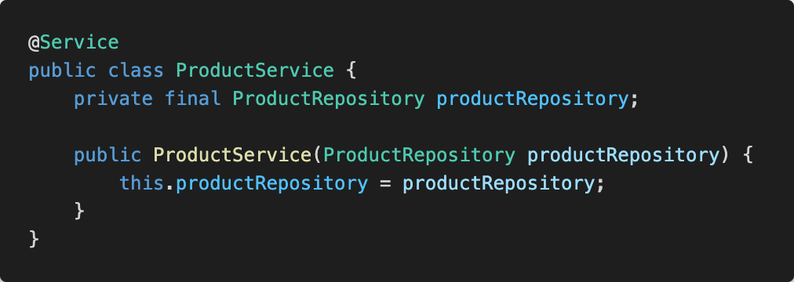
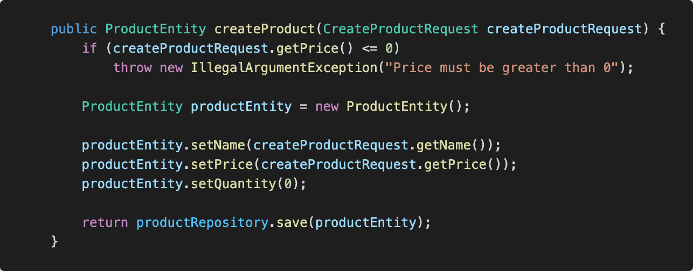
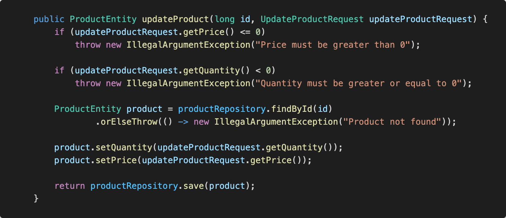
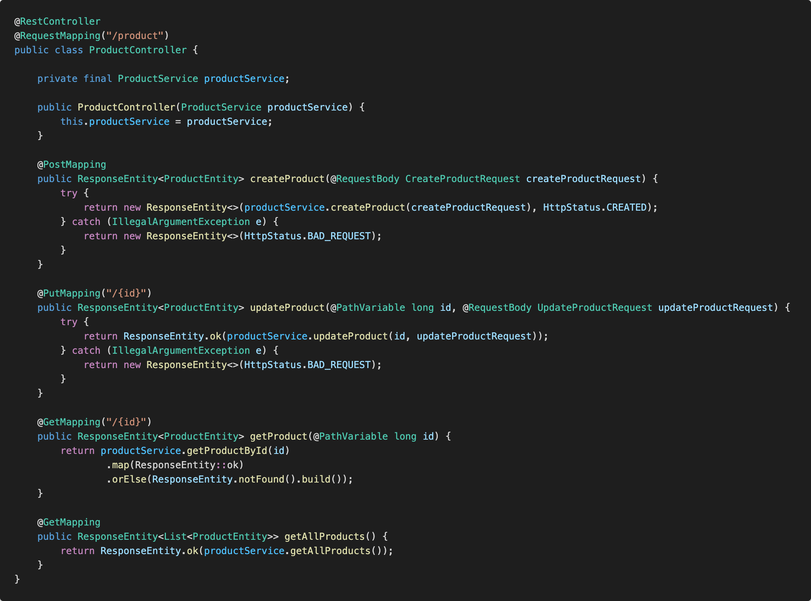

# Laboratorio 04

## Instrucciones

1. Para iniciar, debe crear un *Fork* del repositorio:


2. Vaya la pestaña de **actions** de su repositorio. Si ve un botón verde, haga clic en él para poder ejecutar las pruebas en el futuro.


3. Clone el nuevo repositorio en su computadora y ábralo en IntelliJ.

4. Construya/compile la aplicación en IntelliJ.

5. Ejecute las pruebas unitarias.

6. No se preocupe si todas o la mayoría de las pruebas fallan. Al terminar el laboratorio, todas las pruebas deberían funcionar.
___

## Introducción

- Todos los ejercicios deben compilar para poder ser probados. Si por lo menos uno de los ejercicios no compila, la nota sera de **cero** puntos.
- Si el código original de un ejercicio no se modifica o la intención de su resolución no es clara, la nota del ejercicicio será de **cero puntos**, aún si hay pruebas que sí pasen para dicho ejercicio.
- NO agregue nuevos métodos `main()`, de lo contrario ninguna prueba podrá ejecutarse.
- NO cambie la firma de los métodos existentes (no agrege más parámetros ni cambie el nombre), estos son utilizados para probar su código.
- NO haga cambios en las pruebas, esto resulta en un **cero inmediato**.
- Puede agregar nuevas clases y/o archivos, como sea necesario.
- En la pestaña de **Actions** podrá ver como las pruebas se ejecutan con su código implementado (si hace `git push` de un nuevo commit previamente).
___

## Ejercicio 1

Cree una API capaz de administrar productos. Debe poder llevar registro del nombre de cada producto, la cantidad de producto existente y el precio del mismo.

Para ello, implemente los siguientes endpoints utilizando Spring Boot:

- **POST /product** crea un producto nuevo.
  - Para crear un producto nuevo, es necesario especificar el precio y el nombre.
  - Todos los productos deben iniciar con una cantidad inicial a cero.
  - Si el producto fue creado exitosamente, el código HTTP será `200`.
  - Un producto no puede tener un precio menor o igual a cero. Si se intenta crear un producto con un precio menor a cero, el código HTTP será `400`.
- **GET /product** obtiene una lista de productos
- **GET /product/{id}** obtiene el producto asociado al `id`
  - Si no existe un producto asociado al id, el código HTTP será `404`.
- **PUT /product/{id}** actualiza el registro para el producto asociado al `id`
    - Para actualizar un producto existente, es necesario especificar el precio y la nueva cantidad.
    - Todos los productos deben tener un precio mayor a cero.
    - Todos los productos deben tener una cantidad mayor o igual a cero.
    - Si el producto fue actualizado exitosamente, el código HTTP será `200`.
    - Un producto no puede tener una cantidad negativa ni un precio menor o igual a cero. Si alguna de estas validaciones falla, el código HTTP será `400`.

### POST /product:

#### Ejemplo de petición correcta
```json
{
    "name": "Elotes",
    "price": 0.1
}
```

#### Ejemplo de respuesta exitosa
```json
{
    "id": 2,
    "name": "Elotes",
    "price": 0.1,
    "quantity": 0
}
```

### GET /product

#### Ejemplo de respuesta exitosa
```json
[
  {
    "id": 1,
    "name": "Tomates",
    "price": 0.2,
    "quantity": 0
  },
  {
    "id": 2,
    "name": "Elotes",
    "price": 10.5,
    "quantity": 3
  }
]
```

### GET /product/{id}

#### Ejemplo de respuesta exitosa
```json
{
  "id": 2,
  "name": "Elotes",
  "price": 0.1,
  "quantity": 0
}
```

### PUT /product/{id}:

#### Ejemplo de petición correcta
```json
{
  "price": 10.50,
  "quantity": 3
}
```

#### Ejemplo de respuesta exitosa
```json
{
  "id": 2,
  "name": "Elotes",
  "price": 10.5,
  "quantity": 3
}
```
___

## Guía - Ejercicio 1

1. Instale [Postman](https://www.postman.com/downloads/) y cree una cuenta de ser necesario
2. Implemente el controlador de productos
    1. Cree un paquete `entity` y agregue una clase `ProductEntity` (`Long id`, `String name`, `Double price`, `int quantity`)
        1. Agregue `@Entity` a la clase
        2. Agregue `@Id` y `@GeneratedValue` al atributo de `id`
        3. Genere los getters y setters para cada atributo
    2. Cree un paquete `repository` y agregue una interfaz `ProductRepository extends JpaRepository<ProductEntity, Long>`
        1. Agregue `@Repository` a la interfaz
    3. Cree un paquete `model` y cree una clase `CreateProductRequest`
        1. Agregue los siguientes atributos: `String name` y `Double price`
        2. Genere los getters y setters de cada atributo
    4. En el paquete model, cree una clase `UpdateProductRequest`
        1. Agregue los siguientes atributos: `Double precio` e `int quantity`
        2. Genere los getters y setters de cada atributo
   5. Cree un paquete `service` y agregue una clase `ProductService`
        1. Agregue `@Service` a la clase
        2. Cree un atributo final y privado de tipo `ProductRepository` y cree un constructor para `ProductService` que tome como parámetro un objeto de tipo `ProductRepository`
        3. En el constructor, haga que el atributo de tipo `ProductRepository` apunte al mismo objeto al que apunta el parámetro del constructor 
        4. Cree una función `createProduct(CreateProductRequest createProductRequest)`
            1. Valide que el precio sea mayor que cero, de lo contrario, lance una excepción:  `IllegalArgumentException("Price must be greater than 0")`
            2. Cree un objeto de tipo `ProductEntity` y asigne cada atributo de `createProductRequest` con el valor respectivo del argumento de tipo `CreateProductRequest`.
            3. La cantidad debe iniciar en 0.
            4. Ahora guarde el objeto de productEntity utilizando el atributo de `ProductRepository` y retorne el resultado. 
        5. Cree una función `updateProduct(long id, UpdateProductRequest updateProductRequest)`
            1. Valide que el precio sea mayor que cero, de lo contrario, lance una excepción: `IllegalArgumentException("Price must be greater than 0")`
            2. Valide que la cantidad sea mayor o igual que cero, de lo contrario, lance una excepción: `IllegalArgumentException("Quantity must be greater or equal to 0")`
            3. Valide que el producto con `id` exista, de lo contrario, lance una excepción: `IllegalArgumentException("Product not found")`
            4. Si el producto existe, modifique sus valores con los valores correspondientes del parámetro de tipo `UpdateProductRequest`
            5. Ahora guarde el objeto de `productEntity` utilizando el atributo de `ProductRepository` y retorne el resultado. 
        6. Agregue una función `List<ProductEntity> getAllProducts()`
            1. Retorne el resultado de llamar a la función `findAll()` del atributo de tipo `ProductRepository`
        7. Agregue una función `Optional<ProductEntity> getProductById(Long id)`
            1. Retorne el resultado de llamar a la función `findById()` del atributo de tipo `ProductRepository`
    6. Cree un paquete `controller` y agregue una clase `ProductController`
        1. Agregue `@RestController` y `@RequestMapping(“/product")`
        2. Cree un atributo final y privado de tipo `ProductService` y cree un constructor para `ProductController` que tome como parámetro un objeto de tipo `ProductService`
        3. En el constructor, haga que el atributo de tipo `ProductService` apunte al mismo objeto al que apunta el parámetro del constructor
        4. Cree una función `ResponseEntity<ProductEntity> createProduct(CreateProductRequest createProductRequest)`
        5. Agregue `@PostMapping` a la función
        6. Agregue `@RequestBody` al atributo de tipo `CreateProductRequest`
        7. Utilice el atributo de tipo `ProductService` para crear el producto utilizando el parámetro de tipo `CreateProductRequest` y retorne el resultado con un código HTTP **“created” (201)**.
        8. Si el código retorna una excepción de tipo IllegalArgumentException, entonces retorne un resultado con un código HTTP **“Bad Request” (400)**.
        9. Cree una función `ResponseEntity<ProductEntity> updateProduct(long id, ProductEntity productEntity)`
        10. Agregue `@PutMapping("/{id}")` a la función
        11. Agregue `@PathVariable` al atributo id `@RequestBody` al atributo de tipo `UpdateProductRequest`
        12. Utilice el atributo de tipo `ProductService` para crear el producto utilizando el parámetro de tipo `CreateProductRequest` y retorne el resultado con un código **HTTP “OK” (200)**.
        13. Si el código retorna una excepción de tipo `IllegalArgumentException`, entonces retorne un resultado con un código **HTTP “Bad Request” (400)**.
        14. Cree una función `ResponseEntity<ProductEntity> getProduct(long id)`
        15. Agregue `@GetMapping("/{id}")` a la función
        16. Agregue `@PathVariable` al atributo `id`
        17. Utilice el atributo de tipo `ProductService` para buscar el producto con el id indicado y retorne el resultado con un código **HTTP “OK” (200)**.
        18. Valide que el producto exista, de lo contrario retorne un resultado con código **HTTP “Not Found” (404)**.
        19. Cree una función `ResponseEntity<List<ProductEntity>> getAllProducts()`
        20. Agregue `@GetMapping` a la función
        21. Utilice el atributo de tipo `ProductService` para retornar todos los productos existentes y retorne el resultado con un código **HTTP “OK” (200)** 
3. Ejecute las pruebas de `ProductControllerTest`. Todas deberían funcionar
4. Abra Postman y pruebe su API
___

## Ejercicio 2

Cree un API capaz de administrar carritos de compras. Debe poder llevar registro de los productos agregados, la cantidad de cada producto agregado y el precio total del carrito de compras.

Para ello, implemente los siguientes endpoints utilizando Spring Boot:

- **POST /cart** crea un carrito de compras nuevo.
  - Para crear un carrito de compras nuevos, es necesario especificar el id de cada producto y la cantidad deseada.
  - Todos los productos deben existir.
  - Para poder comprar un producto, debe haber suficiente inventario para ello. Al agregar un producto al carrito, la cantidad se resta del inventario.
  - La cantidad a comprar de un producto debe ser mayor a cero.
  - Si el carrito es creado exitosamente, debe retornar un código **HTTP "Created" (201)**.
  - Si cualquier validación falla al crear el carrito, debe retornarse un código **HTTP "Bad Request" (400)**.
- **GET /cart/{id}** obtiene el carrito de compras asociado al `id`
  - Si no existe un carrito de compras asociado al id, el código HTTP será `404`.

**Tip:** Investigue qué hace la anotación `@OneToMany(cascade = CascadeType.ALL)` y cómo pueda ayudarle a relacionar carritos de compras con productos.